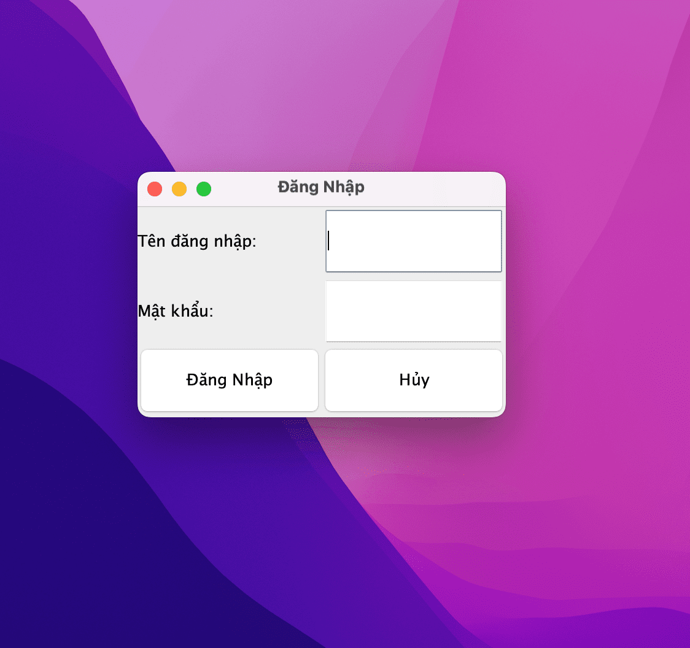

#OOP_GROUP19_N03

# Hệ Thống Quản Lý Thư Viện

## Giới Thiệu Dự Án
Dự án này nhằm xây dựng một hệ thống quản lý thư viện, giúp tự động hóa và tối ưu hóa các hoạt động quản lý sách, tài liệu và thông tin độc giả. Hệ thống sẽ cung cấp các chức năng như:

- Quản lý thông tin sách: thêm, sửa, xóa và tìm kiếm sách.
- Quản lý thông tin độc giả: đăng ký, cập nhật và xóa thông tin người dùng.
- Quản lý mượn và trả sách: theo dõi tình trạng sách và lịch sử mượn trả của độc giả.
- Cung cấp báo cáo thống kê: thống kê số lượng sách, độc giả, và tình trạng mượn sách.

Hệ thống không chỉ giúp cải thiện hiệu quả công việc của nhân viên thư viện mà còn mang lại trải nghiệm tốt hơn cho độc giả khi tra cứu và mượn sách.

## Thành viên nhóm
- Vũ Việt Anh
- Hà Xuân Đại

### Mục Tiêu Dự Án
Mục tiêu chính của dự án là:

- Cải thiện quy trình quản lý thư viện bằng cách tự động hóa các nhiệm vụ thủ công.
- Tạo ra một giao diện người dùng thân thiện, dễ sử dụng.
- Đảm bảo dữ liệu được lưu trữ một cách an toàn và có thể truy xuất dễ dàng.

Dự án này hướng đến việc phát triển một giải pháp toàn diện cho các thư viện, từ thư viện trường học đến thư viện công cộng.

