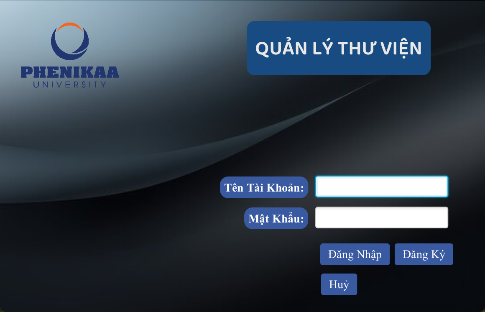
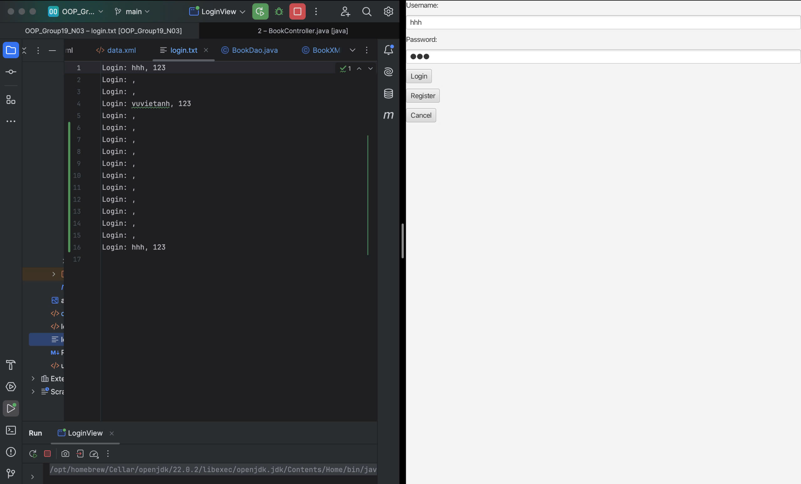

#OOP_GROUP19_N03

# Hệ Thống Quản Lý Thư Viện

## Giới Thiệu Dự Án
Hệ thống quản lý thư viện được xây dựng nhằm mục đích cung cấp một giải pháp đơn giản và hiệu quả để quản lý sách, người dùng, và các giao dịch mượn trả sách trong một thư viện. Người dùng có thể dễ dàng thực hiện các chức năng như thêm mới sách, sửa và xóa sách, quản lý người dùng và xử lý các yêu cầu mượn sách.

## Thành viên nhóm
- Vũ Việt Anh
- Hà Xuân Đại

### Mục Tiêu Dự Án
Mục tiêu chính của dự án là:

- Cải thiện quy trình quản lý thư viện bằng cách tự động hóa các nhiệm vụ thủ công.
- Tạo ra một giao diện người dùng thân thiện, dễ sử dụng.
- Đảm bảo dữ liệu được lưu trữ một cách an toàn và có thể truy xuất dễ dàng.

Dự án này hướng đến việc phát triển một giải pháp toàn diện cho các thư viện, từ thư viện trường học đến thư viện công cộng.

### Demo dự án

[Demo dự án](https://www.youtube.com/watch?v=6aky54z9Sjc)

## UML Dự án 

# 1.1 UML Structural Diagram

# 1.2 UML Behavioural Diagram
# 1.2.1.Sequence diagram

# 1.2.2.Library Management System Flowchart

# Giao diện đăng nhập

# Khi đăng nhập, thông tin đăng nhập sẽ được lưu vào file login.txt

# Triển khai PostgreSQL qua Aiven

